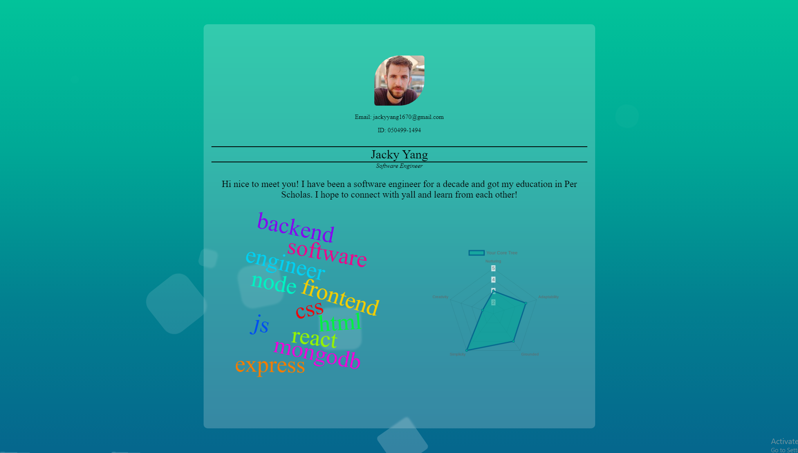

# Per Scholas SBA 308A 

This is a user creation form, and the user can choose between customizing it or randomizing it to stay anonymous. The randomuser api automatically helps us populate random data the player will not need to input themselves. If you choose to customize only a very limited of fields are optional, and most of them will have some sort of validation between each form step. When you are finished with the form, clicking submit will bring you to a page where you can see your profile. Your profile includes: a picture of you, email, id, title, body, and the metric system to showcase who you are! This application uses similar themes as my other Root Applications. All designs and colors follow a plant-like theme (font not chosen; still deciding). 

  
[demo link](https://jordles.github.io/Per-Scholas-SBA-308A/)

## Process / What I Learned

I separated my js files into form, carousel, and the apis (anything related to promises and fetching); For my APIs I utilized: randomuser, jsonplaceholder, and quickchart. All of these don't require an api key and there are no limits to calling them. One of the things I learned from this assignment was how to hash passwords. SHA1 and and MD5 are not secure, but SHA256 still is according to standards. I utilized JS's native web crypto API to help me hash my passwords. 

## Requirements/Tracking

| Requirement | Weight | Finished |
| :-- | :--: | :--: |
| Use the fetch API or Axios to communicate with an external web API. Use the data provided by this API to populate your application’s content and features. | 20% | ✅ |
| Create user interaction with the API through a search feature, paginated gallery, or similar. This feature should use GET requests to retrieve associated data. (select anonymous button from my form to view the original get request data) | 15% | ✅ |
| Enable user manipulation of data within the API through the use of POST, PUT, or PATCH requests. Ensure your chosen API supports this feature before beginning. | 15% | ✅ |
| Make use of Promises and async/await syntax as appropriate. | 15% | ✅ |
| Organize your JavaScript code into at least three (3) different module files, and import functions and data across files as necessary. | 3% | ✅ |
| Ensure the program runs as expected, without any undesired behavior caused by misunderstanding of the JavaScript event loop (such as race conditions, API calls being handled out of order, etc.). | 5% | ✅ |
| Create an engaging user experience through the use of HTML and CSS. | 5% | ✅ |
| Ensure that the program runs without errors (comment out things that do not work, and explain your blockers - you can still receive partial credit). | 10% | ✅ |
| Commit frequently to the git repository. | 5% | ✅ |
| Include a README file that contains a description of your application. | 2% | ✅ |
| Level of effort displayed in creativity, presentation, and user experience. | 5% | ✅ |

## Attribution
[Animated Background: Demo 2](https://wweb.dev/resources/animated-css-background-generator)  
[Random User API: Generated Default User Data](https://randomuser.me/)  
[Metrics Data and Graphs](https://quickchart.io/)  
[JSON MOCK DATA: Allowed us to use PATCH requests with Random User API](https://jsonplaceholder.typicode.com/)

